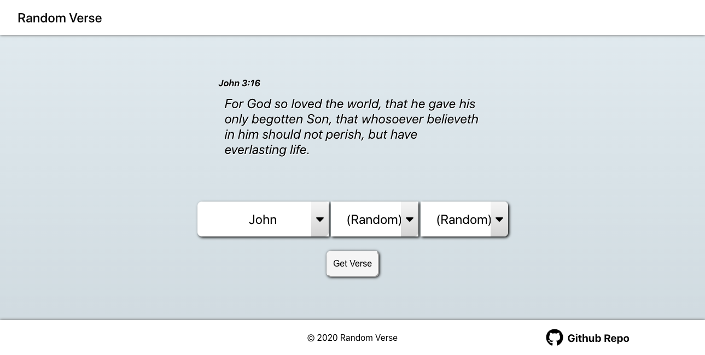

# Random Verse



A project to generate a random bible verse (KJV)

[Demo](https://random-verse.web.app/)

## Installing

install dependencies

```bash
yarn install
```

## Setup 

The bible data is from [API.Bible](https://scripture.api.bible/)

So you will need to get an api key and place into an ```.env``` file.

```javascript
REACT_APP_BIBLE_API= //API key here
```

## Start development server

```bash
yarn start
```

## Built With

* [React](https://reactjs.org/) - React.js

* [VSC](https://code.visualstudio.com/) - Visual Studio Code IDE

## License

This project is licensed under the MIT License